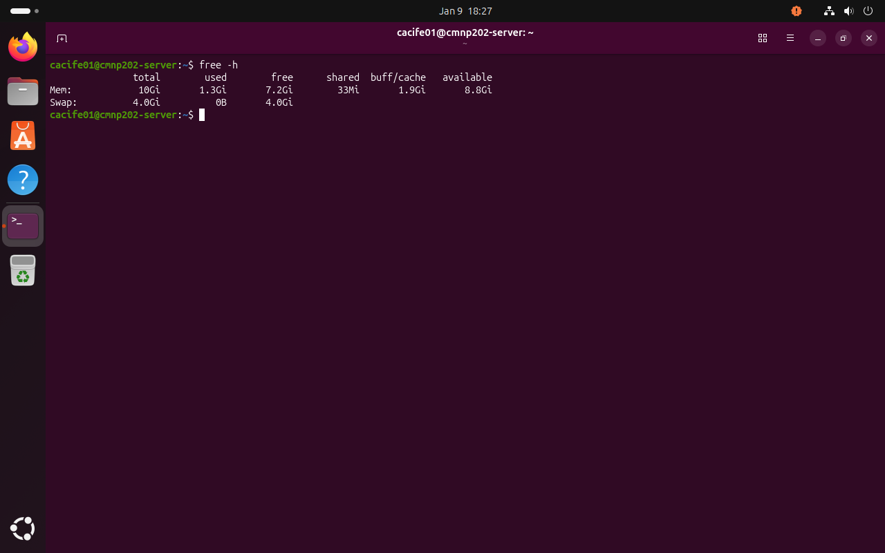
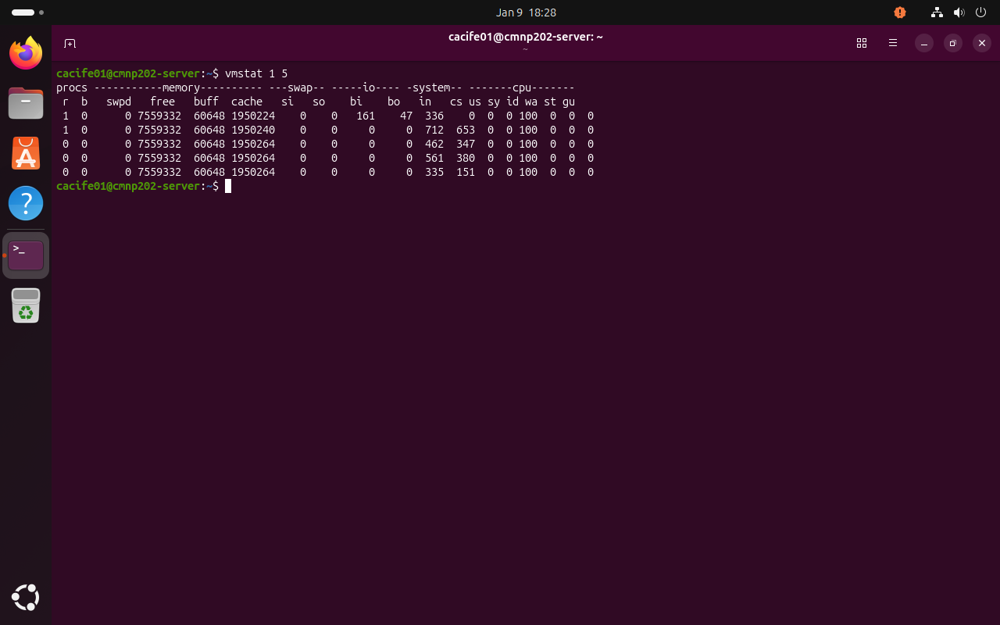
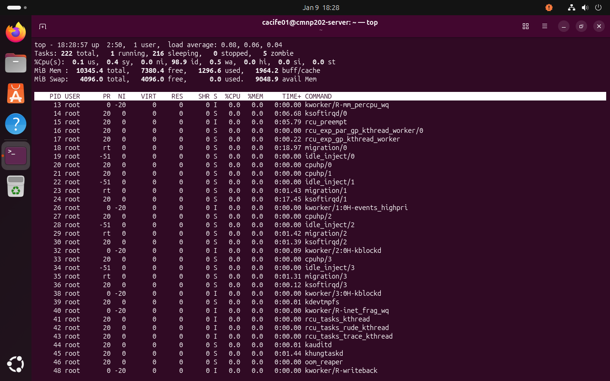
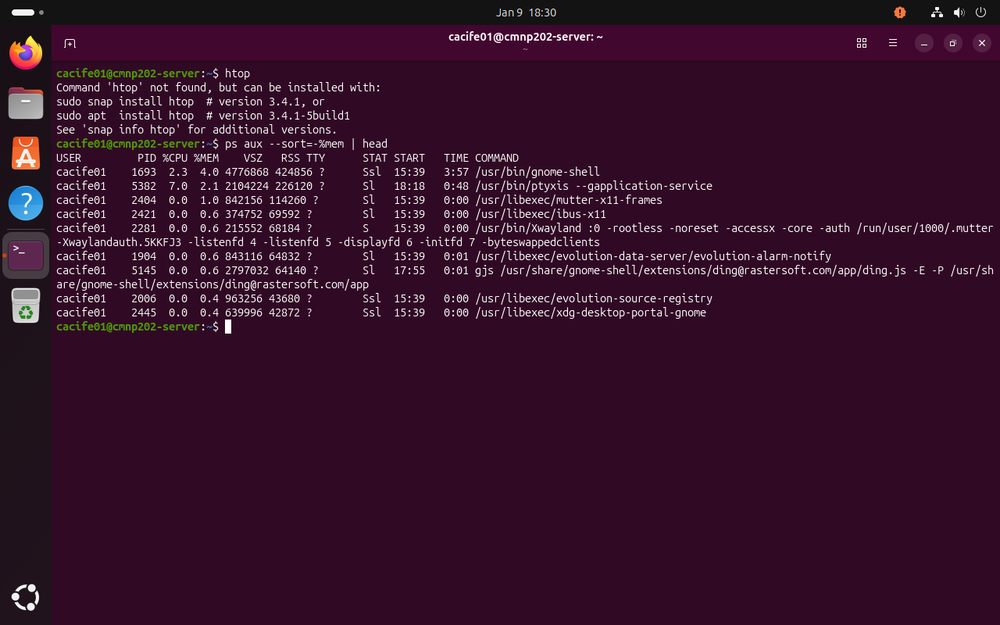
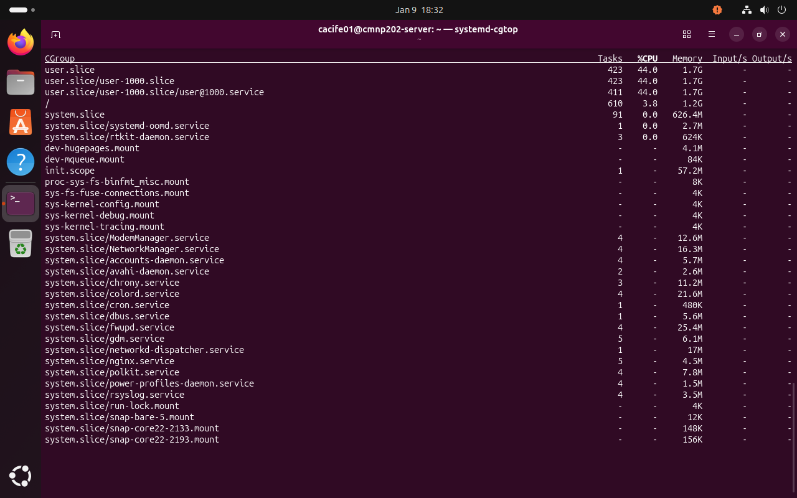

---

layout: default
title: Week 4 – Memory Management
nav_order: 4
---

\## Overview

This week focuses on memory management principles and resource allocation within modern operating systems. The aim is to understand how operating systems manage limited physical memory, provide isolation between processes, and ensure efficient and fair resource usage under concurrent workloads.

---

\## Physical vs Virtual Memory

Physical memory (RAM) is a finite hardware resource that stores actively executing programs and data. Virtual memory extends this limitation by allowing processes to operate as if they have access to a larger, contiguous memory space than physically available.

Virtual memory achieves this by using disk storage as an extension of RAM, enabling multitasking, memory protection, and improved system stability at the cost of increased access latency when swapping occurs.

---

\## Paging and Address Translation

Paging is the primary memory management mechanism used in Linux systems. Virtual address space is divided into fixed-size pages, while physical memory is divided into frames of equal size. A page table maps virtual pages to physical frames, allowing the operating system to translate virtual addresses into physical memory locations.

This mechanism simplifies memory allocation and reduces external fragmentation, though it introduces overhead due to page table maintenance and address translation.

---

\## Segmentation Overview

Segmentation divides memory into variable-sized logical segments such as code, data, and stack. Unlike paging, segmentation aligns closely with program structure and simplifies protection and sharing. However, segmentation can suffer from external fragmentation and is more complex to manage, which is why modern systems typically combine segmentation concepts with paging.

---

\## Memory Allocation Strategies

Operating systems use allocation strategies to assign memory blocks to processes:

\- \*\*First-Fit\*\* allocates the first available block large enough for the request, offering fast allocation but higher fragmentation.

\- \*\*Best-Fit\*\* allocates the smallest suitable block, reducing wasted space but increasing allocation time.

\- \*\*Worst-Fit\*\* allocates the largest available block, preserving medium-sized blocks but often leading to inefficient memory use.

The choice of strategy represents a trade-off between performance and memory efficiency.

---

\## Garbage Collection Concepts

Garbage collection is an automated memory management technique that reclaims memory occupied by objects no longer referenced by a program. The mark-and-sweep algorithm identifies reachable objects and frees unused memory, preventing memory leaks and improving system stability. While beneficial for developer productivity, garbage collection introduces runtime overhead.

---

\## Resource Isolation and Allocation

Modern operating systems enforce resource isolation to prevent individual applications from monopolising system resources. Linux achieves this through:

\- \*\*Namespaces\*\*, which isolate system resources such as process IDs, networks, and mount points.

\- \*\*Control Groups (cgroups)\*\*, which limit and prioritise CPU, memory, disk I/O, and network usage.

These mechanisms are essential in multi-tenant and cloud environments to ensure fairness and stability.

---

\## Containerisation and Resource Control

Containerisation technologies such as Docker use namespaces and cgroups to provide lightweight isolation while sharing the host operating system kernel. Compared to virtual machines, containers offer faster start-up times and lower resource overhead, making them suitable for scalable and cloud-native deployments.

Resource limits and Quality of Service (QoS) classifications ensure containers do not exceed allocated resources, protecting system performance during contention.

---

\## Memory Monitoring Tools

Memory usage and allocation behaviour can be monitored using command-line utilities:

\- `top` and `htop` for real-time process memory usage

\- `free -h` for physical and swap memory overview

\- `vmstat` for virtual memory and paging statistics

These tools are essential for diagnosing memory bottlenecks and evaluating system performance.

---

Understanding memory management and resource allocation highlights the trade-offs between performance, efficiency, and isolation in operating system design. These concepts are fundamental in modern cloud, containerised, and multi-tenant systems, where efficient resource control directly impacts scalability, stability, and security.

A) SSH screenshot

\*Figure 1: Secure SSH access from the workstation system to the headless Linux server using key-based authentication.\*

B) free -h screenshot (physical vs virtual memory)

C) vmstat screenshot (paging and virtual memory)

\*Figure 3: `vmstat` output illustrating virtual memory activity, free memory, and paging behaviour over time.\*

D) top / htop screenshot (per-process memory)

\*Figure 4: Real-time process monitoring showing per-process memory consumption and system resource usage.\*

E) ps aux --sort=%mem | head (Resource Allocation)

\*Figure 5: Processes sorted by memory usage, illustrating how memory is distributed among running applications.\*

F) system-cgtop (Resource Isolation and Allocation)

\*Figure 6: `systemd-cgtop` output showing resource usage across control groups, demonstrating Linux cgroup-based resource isolation.\*

