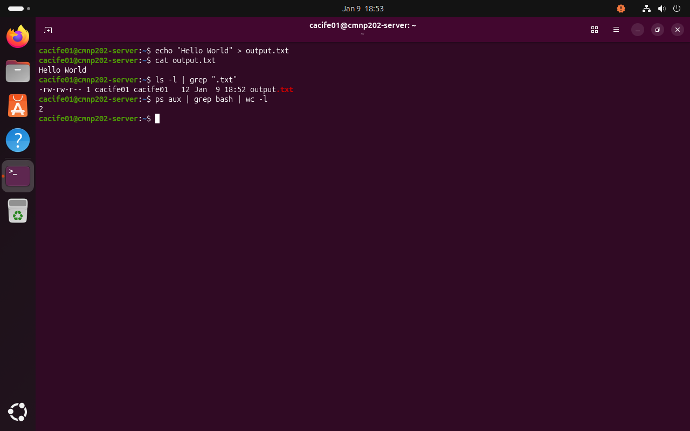
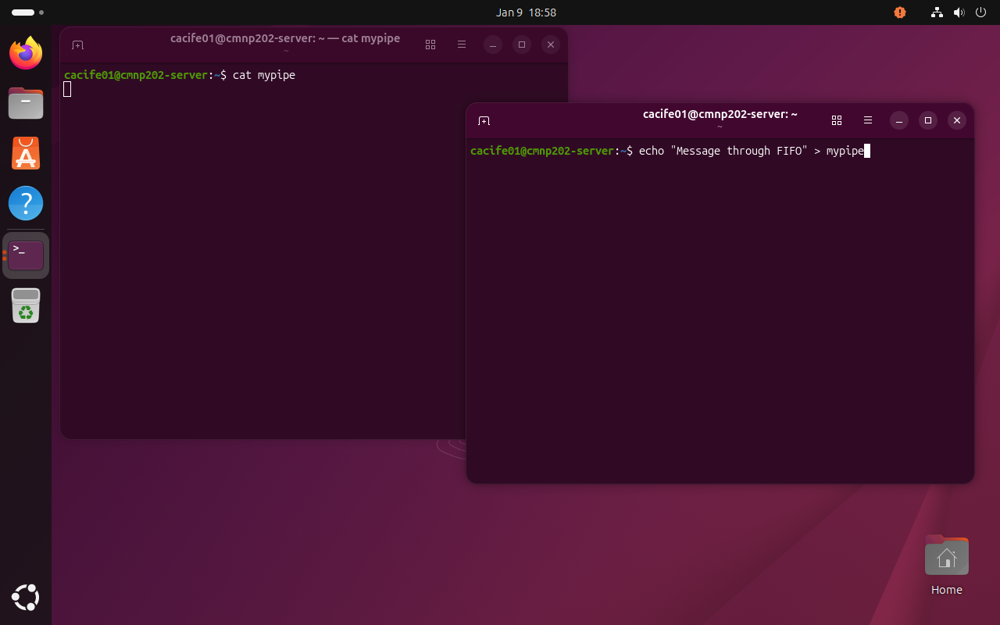
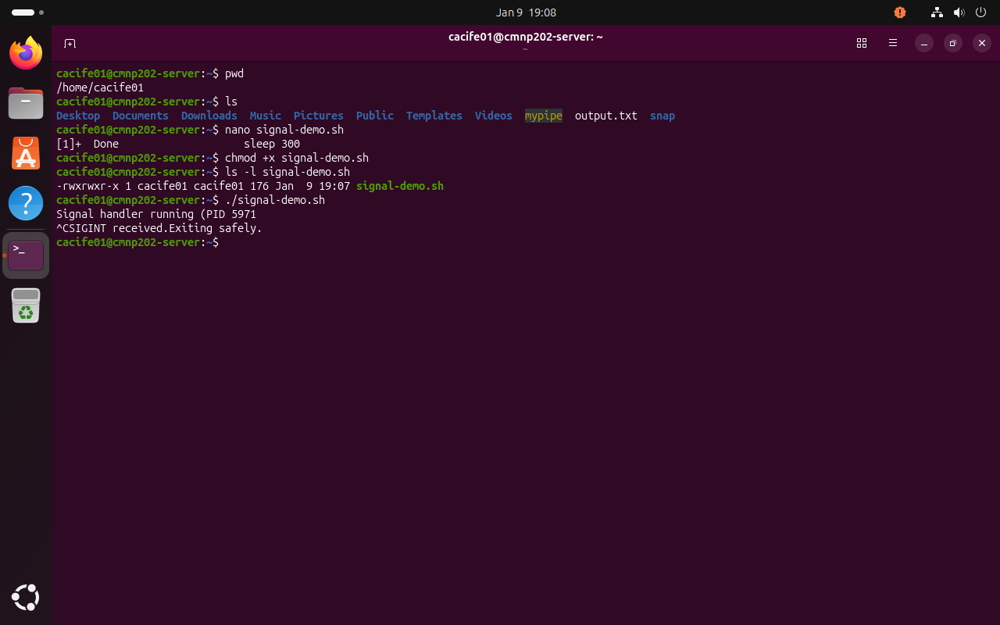
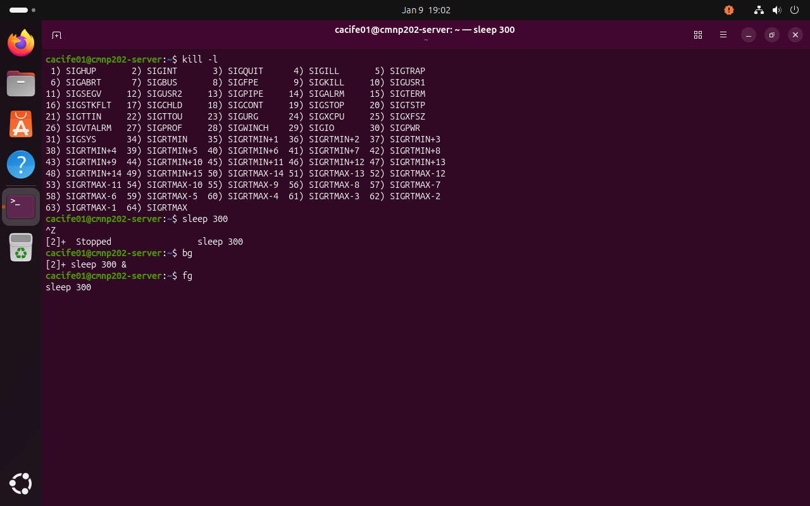

\## Overview

This week focuses on inter-process communication (IPC) mechanisms in Linux. IPC enables cooperating processes to exchange data and coordinate execution. Practical examples were implemented to demonstrate pipes, named pipes (FIFOs), signals, and file-based communication.

All activities were performed via the command-line interface in accordance with the coursework requirements.

A) Pipes and Redirection

Pipes allow the output of one process to be used directly as input for another process, enabling efficient data flow between commands. This reflects the Unix philosophy of composing small, modular programs to perform complex tasks.

\*Figure 1: Example of anonymous pipe usage, where process output is passed through multiple commands to produce a final result.\*

B) Named Pipes (FIFOs)

Named pipes (FIFOs) enable communication between unrelated processes using a special file in the filesystem. Unlike anonymous pipes, FIFOs persist until explicitly removed and allow separate processes to exchange data.

\*Figure 2: Communication between two unrelated processes using a named pipe (FIFO). One process blocks waiting for input while the other writes data to the pipe.\*

C) Process Signals

Signals are asynchronous notifications sent to processes to control execution or indicate events. Signals such as SIGTERM allow graceful termination, while SIGKILL forcefully stops a process and cannot be intercepted.

\*Figure 3: Sending termination signals to a running process, demonstrating graceful and forceful process control using Unix signals.\*

D) Signal Handling Script

Signal handling allows applications to respond gracefully to termination requests. By trapping signals, programs can clean up resources and exit safely instead of being abruptly terminated.

\*Figure 4: Custom Bash script handling SIGINT using a trap, allowing graceful program termination.\*

Inter-process communication mechanisms provide essential coordination between running programs. Pipes offer efficient communication between related processes, while FIFOs allow interaction between unrelated processes. Signals provide lightweight process control but require careful handling to ensure robustness. Understanding IPC is fundamental for designing reliable multi-process systems.

